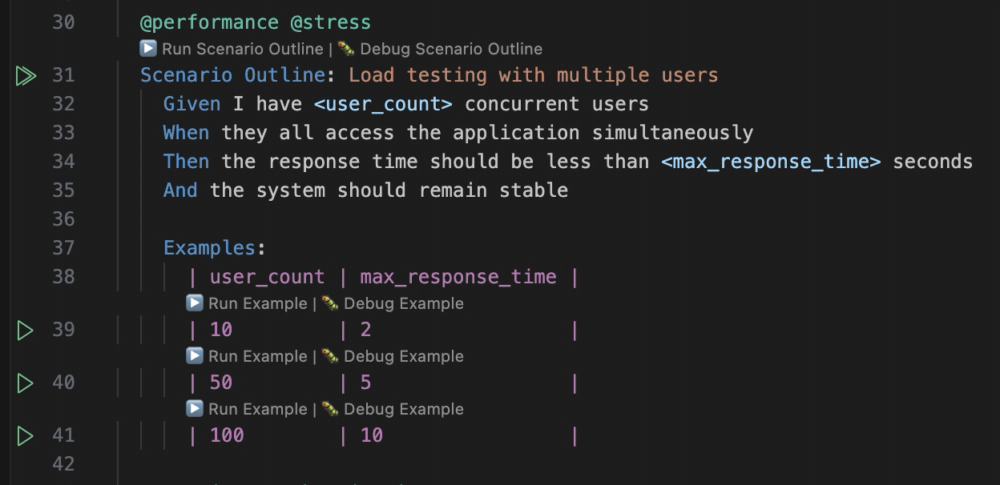
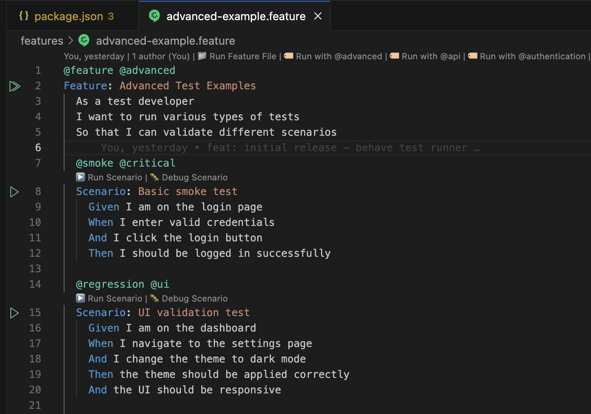
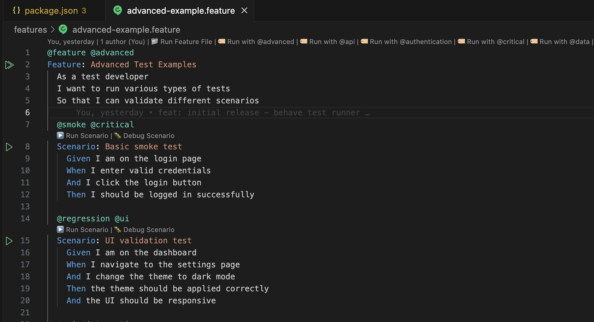
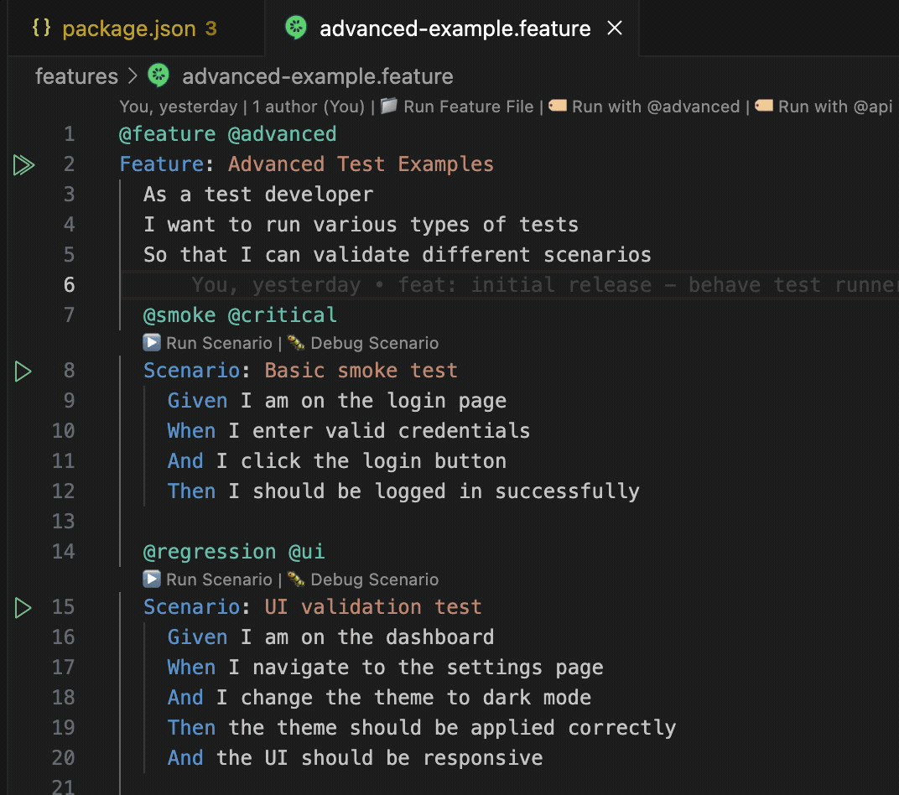

# Behave Test Runner

A VS Code extension for discovering, running, and debugging [Behave](https://behave.readthedocs.io/) tests with full integration into the VS Code testing framework.

## Features

- 🔍 **Automatic Test Discovery**: Automatically finds and parses `.feature` files in your workspace
- ▶️ **Run Tests**: Run individual scenarios or entire feature files with a single click
- 🐛 **Debug Support**: Debug scenarios with full VS Code debugging capabilities
- 📊 **Test Explorer Integration**: View and manage tests in the VS Code Test Explorer with organized hierarchy
- 🎯 **CodeLens Support**: Run/debug scenarios directly from the editor with inline buttons
- 🏷️ **Tag-based Organization**: Automatically groups scenarios by tags for better organization
- 📋 **Scenario Outline Support**: Full support for scenario outlines with individual example tracking
- 🔢 **Smart Example Naming**: Clean, numbered examples (1:, 2:, 3:) instead of verbose names
- 📏 **Long Column Names Handling**: Intelligently truncates long table column names for readability
- ⚙️ **Configurable**: Customize behave command, working directory, and more
- 🔄 **Auto-refresh**: Automatically updates when feature files change
- 🚀 **Parallel Execution**: Run tests in parallel for faster execution
- 🤝 **Extension Compatibility**: Designed to work seamlessly with Cucumber (Gherkin) Full Support

## Installation

### From VSIX

1. Download the latest `.vsix` file from the [releases page](https://github.com/your-username/behave-test-runner/releases)
2. In VS Code, go to Extensions (Ctrl+Shift+X)
3. Click the "..." menu and select "Install from VSIX..."
4. Select the downloaded file

### From Source

```bash
git clone https://github.com/your-username/behave-test-runner.git
cd behave-test-runner
npm install
npm run compile
npm run package
```

## Usage

### Prerequisites

- Python with Behave installed (`pip install behave`)
- VS Code 1.99.0 or later

### Basic Usage

1. **Open a workspace** containing `.feature` files
2. **Discover tests** by running the "Behave: Discover Tests" command
3. **View tests** in the Test Explorer (Ctrl+Shift+P → "Testing: Focus on Test Explorer View")
4. **Run tests** by clicking the play button next to any test
5. **Debug tests** by clicking the debug button next to any test

### Test Organization/Test View

The extension automatically organizes your tests in the Test Explorer with multiple organization strategies:

#### Default: Feature-Based (Hierarchical) Organization

The extension uses **Feature-Based (Hierarchical) Organization** as the default strategy:

- **Feature Files**: Top-level containers for your feature files
- **Scenarios**: Nested as children under their respective feature files
- **Scenario Outlines**: Special groups for scenario outlines with their examples
- **Individual Scenarios**: Regular scenarios and scenario outline examples

> **Note**: The default organization strategy is set in the extension code and cannot be changed via configuration. You can switch between strategies using the context menu in the Test Explorer.

###### Switching views


#### Alternative Organization Strategies

- **Tag-Based Organization**: Groups scenarios by their tags (e.g., `@smoke`, `@regression`)
- **File-Based Organization**: Groups scenarios by their file paths
- **Scenario Type Organization**: Groups by scenario type (regular vs outline)
- **Flat Organization**: All scenarios at the same level

**Switch Organization**: Right-click in the Test Explorer → "Organization Strategy" → Choose your preferred organization strategy

The extension provides enhanced support for scenario outlines:

- **Clean Example Names**: Examples are named as "1:", "2:", "3:" instead of "Example 1", "Example 2"
- **Long Column Name Handling**: Column names longer than 15 characters are truncated for readability
- **Multiple Outlines**: Support for multiple scenario outlines in the same feature file
- **Sorted Examples**: Examples are automatically sorted by their number
- **Organized Hierarchy**: Scenario outline examples are grouped under their parent outline

#### Extended support for scenario outline
- Execute test from scenario outline level or example

- Hierachichal view of scenario outline examples for easy navigation


### CodeLens Features

When you open a `.feature` file, you'll see inline buttons above each scenario:

- ▶️ **Run Scenario**: Runs the specific scenario
- 🐛 **Debug Scenario**: Debugs the specific scenario

#### Code lens inline buttons
- Feature inline buttons [Run Feature File]| Run with <@tags-available> | ...

- Play button on feature level will execute feature and update test explorer on test outcome

- Play button scenario level will execute an individual scenario 


> **Note**: Right click on play button will give additional options like debugging test

### Commands

| Command                              | Description                                    |
| ------------------------------------ | ---------------------------------------------- |
| `Behave: Discover Tests`             | Manually discover and load test files          |
| `Behave: Refresh Tests`              | Refresh and reload all test files              |
| `Behave: Run All Tests`              | Run all tests in the workspace                 |
| `Behave: Run All Tests in Parallel`  | Run all tests in parallel for faster execution |
| `Behave: Run Scenario`               | Run a specific scenario (used by CodeLens)     |
| `Behave: Debug Scenario`             | Debug a specific scenario (used by CodeLens)   |
| `Behave: Run Feature File`           | Run an entire feature file                     |
| `Behave: Run Feature File with Tags` | Run a feature file with specific tags          |

## Configuration

### Extension Settings

| Setting                                 | Default          | Description                                                                                          |
| --------------------------------------- | ---------------- | ---------------------------------------------------------------------------------------------------- |
| `behaveTestRunner.behaveCommand`        | `"behave"`       | Command to run Behave tests (auto-detects Python if needed)                                          |
| `behaveTestRunner.workingDirectory`     | `""`             | Working directory for test execution (empty = workspace root)                                        |
| `behaveTestRunner.autoDiscoverTests`    | `true`           | Automatically discover tests on startup                                                              |
| `behaveTestRunner.testFilePattern`      | `"**/*.feature"` | Glob pattern for test file discovery                                                                 |
| `behaveTestRunner.enableCodeLens`       | `true`           | Enable CodeLens buttons on feature files (disable if conflicting with other extensions)              |
| `behaveTestRunner.enableTestExplorer`   | `true`           | Enable Test Explorer integration (disable if conflicting with other test explorers)                  |
| `behaveTestRunner.priority`             | `"normal"`       | Extension priority for handling feature files (use 'low' if other extensions should take precedence) |
| `behaveTestRunner.parallelExecution`    | `false`          | Enable parallel execution of feature files                                                           |
| `behaveTestRunner.maxParallelProcesses` | `4`              | Maximum number of parallel processes for test execution                                              |
| `behaveTestRunner.outputFormat`         | `"pretty"`       | Output format for behave test results (pretty, plain, json, junit, progress, steps)                  |
| `behaveTestRunner.tags`                 | `""`             | Default tags to filter tests (e.g., '@smoke,@regression')                                            |
| `behaveTestRunner.dryRun`               | `false`          | Enable dry run mode to see what tests would be executed without running them                         |

### Intelligent Command Detection

The extension automatically detects the correct Python command for your system:

- **macOS/Linux**: Tries `python3`, `python`, then `py`
- **Windows**: Tries `py`, `python`, then `python3`
- **Fallback**: Uses `python3 -m behave` if direct `behave` command is not available

You can override this by setting a specific command in your configuration.

### Example Configuration

```json
{
  "behaveTestRunner.behaveCommand": "python3 -m behave",
  "behaveTestRunner.workingDirectory": "${workspaceFolder}/tests",
  "behaveTestRunner.autoDiscoverTests": true,
  "behaveTestRunner.testFilePattern": "**/features/**/*.feature",
  "behaveTestRunner.enableCodeLens": true,
  "behaveTestRunner.enableTestExplorer": true,
  "behaveTestRunner.priority": "normal",
  "behaveTestRunner.parallelExecution": false,
  "behaveTestRunner.maxParallelProcesses": 4,
  "behaveTestRunner.outputFormat": "pretty",
  "behaveTestRunner.tags": "@smoke,@regression",
  "behaveTestRunner.dryRun": false
}
```

### Example Feature Files

**Basic Scenario Outline:**

```gherkin
@feature @login
Feature: User Login

  @smoke @critical
  Scenario Outline: Login with different credentials
    Given I am on the login page
    When I enter username "<username>" and password "<password>"
    And I click the login button
    Then I should see "<expected_result>"

    Examples:
      | username | password | expected_result |
      | admin    | admin123 | dashboard       |
      | user     | user123  | dashboard       |
      | invalid  | wrong    | error message   |
```

**Multiple Scenario Outlines:**

```gherkin
@feature @api
Feature: API Testing

  @api @validation
  Scenario Outline: Data validation with various inputs
    Given I have a valid API endpoint
    When I send "<data_type>" data with value "<input_value>"
    Then the response should contain "<validation_result>"

    Examples:
      | data_type | input_value | validation_result |
      | string    | hello       | valid             |
      | number    | 42          | valid             |
      | email     | test@test   | invalid           |

  @performance @load
  Scenario Outline: Load testing with different user loads
    Given I have configured the load testing environment
    When I simulate "<concurrent_users>" concurrent users
    Then the system should handle the load successfully

    Examples:
      | concurrent_users |
      | 10               |
      | 50               |
      | 100              |
```

In the Test Explorer, these will appear as:

**Feature-Based (Hierarchical) Organization (Default):**

- **Feature: User Login**
  - **Scenario Outline: Login with different credentials**
    - **1: Login with different credentials - username: admin, password: admin123, expected_result: dashboard**
    - **2: Login with different credentials - username: user, password: user123, expected_result: dashboard**
    - **3: Login with different credentials - username: invalid, password: wrong, expected_result: error message**

**Tag-Based Organization:**

- **@smoke** (group)
  - **1: Login with different credentials - username: admin, password: admin123, expected_result: dashboard**
  - **2: Login with different credentials - username: user, password: user123, expected_result: dashboard**

## Extension Compatibility

This extension is designed to work alongside other VS Code Gherkin extensions. 

### Recommended Configuration with Cucumber (Gherkin) Full Support

**Note**: This extension is developed and tested with Cucumber (Gherkin) Full Support extension. Since you're using Cucumber (Gherkin) Full Support for syntax highlighting and autocomplete, this extension focuses on test execution and discovery. The extensions complement each other perfectly:

```json
{
  "behaveTestRunner.enableCodeLens": true,
  "behaveTestRunner.enableTestExplorer": true,
  "behaveTestRunner.priority": "low",
  "behaveTestRunner.defaultOrganizationStrategy": "FeatureBasedOrganization"
}
```

**Why this works well:**

- **Cucumber Extension**: Handles syntax highlighting, autocomplete, and Gherkin language support
- **Behave Test Runner**: Handles test discovery, execution, and Test Explorer integration
- **No Conflicts**: Each extension has its own domain of responsibility

### Extension Priority

The `priority` setting determines which extension takes precedence when multiple extensions can handle the same file type:

- **`"low"`**: Let other extensions handle `.feature` files first
- **`"normal"`**: Standard priority
- **`"high"`**: Take precedence over other extensions

## Project Structure

```
src/
├── core/                   # Core functionality
│   └── test-executor.ts    # Test execution logic
├── parsers/                # File parsing
│   └── feature-parser.ts   # Gherkin feature file parser
├── test-providers/         # VS Code test integration
│   └── behave-test-provider.ts
├── commands/               # VS Code commands
│   └── command-manager.ts  # Command registration and handling
├── utils/                  # Utilities
│   └── logger.ts           # Logging utility
├── types/                  # TypeScript type definitions
│   └── index.ts            # Shared interfaces and types
└── extension.ts            # Main extension entry point
```

## Development

### Prerequisites

- Node.js 20.x or later
- npm or yarn

### Setup

```bash
# Install dependencies
npm install

# Compile TypeScript
npm run compile

# Run tests
npm test

# Package extension
npm run package
```

### Development Scripts

| Script                     | Description                            |
| -------------------------- | -------------------------------------- |
| `npm run compile`          | Compile TypeScript and build extension |
| `npm run watch`            | Watch for changes and recompile        |
| `npm run lint`             | Run ESLint                             |
| `npm run lint:fix`         | Fix ESLint issues                      |
| `npm test`                 | Run all tests                          |
| `npm run package`          | Create VSIX package                    |
| `npm run package:vsix`     | Create VSIX package with version       |
| `npm run dev`              | Start development mode                 |
| `npm run test:unit`        | Run unit tests only                    |
| `npm run test:integration` | Run integration tests only             |
| `npm run test:parser`      | Run parser tests only                  |
| `npm run test:execution`   | Run execution tests only               |

### Testing

The extension includes comprehensive tests:

- **Unit Tests**: Test individual components
- **Integration Tests**: Test VS Code integration
- **Parser Tests**: Test Gherkin parsing
- **Execution Tests**: Test test execution

**Current Test Status**: 111 tests passing, 1 failing (33 lint warnings in source files only)

Run tests with:

```bash
npm test                   # Run all tests
npm run test:unit          # Run unit tests only
npm run test:integration   # Run integration tests only
npm run test:parser        # Run parser tests only
npm run test:execution     # Run execution tests only
```

## Contributing

1. Fork the repository
2. Create a feature branch (`git checkout -b feature/amazing-feature`)
3. Commit your changes (`git commit -m 'Add amazing feature'`)
4. Push to the branch (`git push origin feature/amazing-feature`)
5. Open a Pull Request

### Code Style

- Follow TypeScript best practices
- Use ESLint for code linting
- Write comprehensive tests
- Follow conventional commit messages

## Troubleshooting

### Common Issues

**Tests not discovered:**

- Ensure `.feature` files exist in your workspace
- Check the `testFilePattern` setting
- Try running "Behave: Discover Tests" manually

**Tests not running:**

- Verify Behave is installed (`behave --version`)
- Check the `behaveCommand` setting
- Ensure the working directory is correct

**Debug not working:**

- Make sure Python debugger is configured
- Check that the Python extension is installed
- Verify the debug configuration

### Logs

Enable detailed logging by opening the Output panel (View → Output) and selecting "Behave Test Runner" from the dropdown.

## License

This project is licensed under the MIT License - see the [LICENSE](LICENSE) file for details.

## Changelog

See [CHANGELOG.md](CHANGELOG.md) for a list of changes and version history.

## Support

<b>"Code, coffee, repeat. Support the cycle!</b> : If you enjoy using <b>Behave Test Runner</b>, consider contributing to fuel my coding dreams!

<a href="https://buymeacoffee.com/upscaled.dev" target="_blank"></a>


## Acknowledgments

- [Behave](https://behave.readthedocs.io/) - Python BDD framework
- [VS Code Extension API](https://code.visualstudio.com/api) - Extension development framework
- [Gherkin](https://cucumber.io/docs/gherkin/) - BDD syntax specification
- [Cucumber (Gherkin) Full Support](https://marketplace.visualstudio.com/items?itemName=alexkrechik.cucumberautocomplete) - VS Code extension for Gherkin syntax highlighting and autocomplete
- [Freepik](https://www.freepik.com/) - Extension icon design
